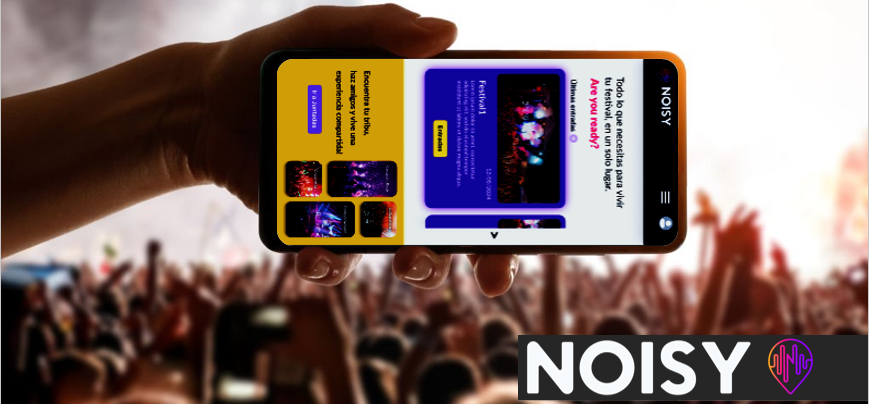
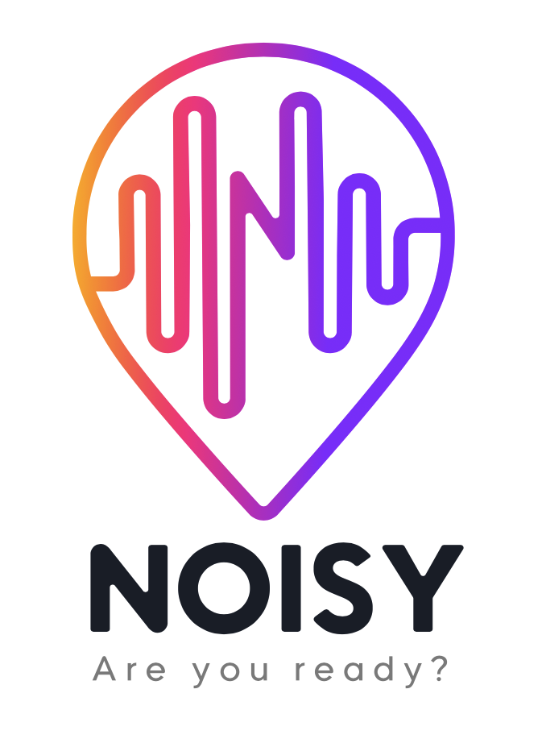
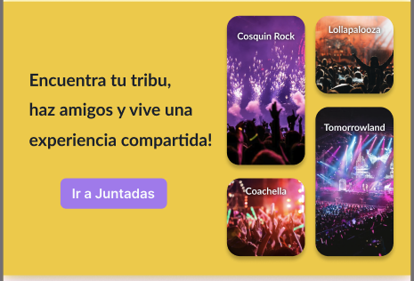
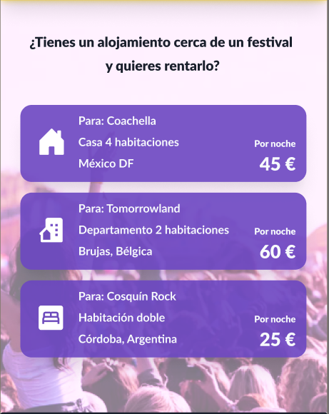
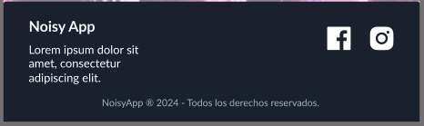

# Noisy By Igrowker


# ¡Bienvenido a Noisy!

Noisy es mucho más que una aplicación web; es tu pasaporte a la experiencia definitiva en eventos. Diseñada pensando en la generación de los festivales, Noisy te acerca a los momentos que te hacen vibrar: desde los épicos escenarios de Lollapalooza hasta los vibrantes ritmos de Tomorrowland.

Con Noisy, el acceso a tus eventos favoritos está al alcance de tu mano. ¿Buscas entradas para el próximo Cosquin Rock? ¿O quizás deseas sumergirte en la magia de Coachella? Con nuestra plataforma mobile-first, la experiencia de compra es rápida, sencilla y segura.

Pero Noisy es mucho más que un lugar para comprar entradas. Es una comunidad vibrante donde los organizadores pueden dar vida a sus eventos, desde pequeñas reuniones hasta festivales masivos. Los usuarios pueden descubrir nuevos eventos, compartir viajes, encontrar alojamiento y conectarse con otros amantes de la música de todo el mundo.

Los anfitriones también tienen su lugar en Noisy. ¿Tienes un lugar para alojar a los asistentes de un festival? Con nuestra plataforma, puedes promocionar tu espacio y ofrecer una experiencia única a los viajeros y entusiastas de la música.

Con Noisy, la diversión no se detiene después del concierto. Los organizadores pueden acceder a métricas detalladas para optimizar sus eventos, mientras que los usuarios pueden compartir sus experiencias y planificar su próximo viaje con amigos.

Únete a la comunidad Noisy y déjate llevar por la emoción de los eventos en vivo. ¡Prepárate para vivir momentos inolvidables y sumergirte en la música que te mueve!


# ¡Descripción!
 ¡Saludos! Soy Gustavo Villegas, y me complace presentarte Noisy, un emocionante proyecto que abarca mucho más que la simple compra de entradas para eventos.

 Mi papel en este proyecto fue multifacético y desafiante. Como parte del equipo de desarrollo, contribuí en diversas áreas para dar vida a Noisy. Desde la creación de componentes individuales hasta la colaboración en el diseño de interfaces liderada por (Patricia Gonzales Garcia)[https://github.com/patrigarcia] crack CPO & Co-Founder at Igrowker | Software Developer | Product Designer, mi trabajo fue fundamental para garantizar una experiencia fluida y atractiva para nuestros usuarios.

 Una de mis principales responsabilidades fue la creación y gestión de APIs dentro del proyecto. Trabajé arduamente para simular datos realistas extraídos de fuentes externas, lo que permitió a nuestros usuarios acceder a información relevante sobre eventos, alojamiento y más.

 Además, participé activamente en la implementación de componentes y la integración de diferentes vistas para crear una experiencia cohesiva y atractiva para nuestros usuarios. Colaboré estrechamente con mis compañeros de equipo para asegurarnos de que cada pantalla y funcionalidad cumpliera con los estándares de calidad y usabilidad.

 En resumen, mi posición en Noisy fue de vital importancia para su desarrollo y éxito. Desde la creación de componentes hasta la implementación de APIs, me esforcé por contribuir de manera significativa a este emocionante proyecto que redefine la forma en que experimentamos los eventos en vivo.


# Tecnologías utilizadas

- **React.js:** Utilizado para la construcción de la interfaz de usuario del proyecto.
- **Chakra UI:** Framework de diseño utilizado para el desarrollo de componentes y estilos de la interfaz de usuario.
- **React Icons:** Librería utilizada para la incorporación de iconos en la aplicación.
- **JSON Server:** Utilizado para simular una API RESTful y manejar los datos del proyecto.
- **Git y GitHub:** Sistema de control de versiones distribuido y plataforma de alojamiento de repositorios, respectivamente, utilizados para la colaboración y gestión del código del proyecto.


# Instrucciones de instalación para descargar y ejecutar el proyecto en un entorno local:

1. Abre la terminal de tu sistema operativo. Puedes utilizar la terminal de Visual Studio Code, la terminal de Windows o la terminal de macOS.

Clona el repositorio ejecutando el siguiente comando en la terminal:

```bash
Copiar código
git clone https://github.com/opel777/intake-001-noisy.git
```

2. Una vez clonado el repositorio, accede al directorio del proyecto con el siguiente comando:
   
```bash
Copiar código
cd intake-001-noisy
```

3. Instala las dependencias del proyecto utilizando npm. Ejecuta el siguiente comando:
   
```bash
Copiar código
npm install
```

4. Una vez que se hayan instalado todas las dependencias, puedes iniciar el servidor de desarrollo local ejecutando el siguiente comando:
   
```bash
Copiar código
npm start
```

Este comando iniciará el servidor de desarrollo y abrirá automáticamente el proyecto en tu navegador web predeterminado.

¡Ahora has descargado y ejecutado el proyecto en tu entorno local!

# contibucion!

Dentro de las tareas a realizar dentro del proyecto podems destacar de mi contribucin los siguientes componentes:

Durante mi participación en el proyecto Noisy by Igrowker, desempeñé un papel esencial en el desarrollo y mejora del producto, centrándome en diferentes áreas y contribuyendo significativamente al éxito del proyecto. A continuación, detallo mi contribución en la creación y desarrollo de la sección de Juntadas:

1. # Sección Juntadas (Landing)
   
- En esta sección, fui responsable de desarrollar el componente Juntadas del componente landing. Este componente tenía como objetivo principal crear una sección promocional donde los usuarios pudieran visualizar eventos relacionados con festivales como Lollapalooza, Cosquin Rock, Tomorrowland y Coachella.

- **Desarrollo de Componentes:** Diseñé y desarrollé componentes clave para la visualización de eventos, utilizando tecnologías como ReactJS y Chakra UI. Implementé un diseño de tarjeta que mostraba información relevante sobre cada evento, como el nombre del evento, la ubicación y una imagen representativa.
- 
- **Integración de Datos:** Utilicé datos simulados para representar eventos ficticios en la aplicación. Estos datos se renderizaron dinámicamente en las tarjetas de evento, creando una experiencia interactiva para los usuarios.
- 
- **Colaboración en el Diseño:** Trabajé en estrecha colaboración con nuestro equipo de diseño, liderado por Patricia Gonzalez Garcia, para garantizar que el diseño de la sección Juntadas se alineara con las especificaciones del diseño y proporcionara una experiencia visualmente atractiva para los usuarios.
- 
  Mi trabajo en la sección Juntadas fue fundamental para proporcionar a los usuarios una manera intuitiva y atractiva de explorar eventos relacionados con festivales y promover la participación en la plataforma. Contribuí al éxito general del proyecto al asegurarme de que esta sección cumpliera con los estándares de calidad y diseño establecidos por el equipo.

   


   2. # Seccion Accommodation (Landing)
   
- En esta sección, mi responsabilidad fue la creación del componente Accommodation, el cual tiene como objetivo mostrar de manera promocional lugares de alojamiento cercanos a eventos. Aquí destaco los detalles de mi contribución y los desafíos enfrentados:

- **Desarrollo del Componente:** Diseñé y desarrollé el componente Accommodation utilizando tecnologías como ReactJS y Chakra UI. El componente muestra tres tarjetas promocionales que representan diferentes tipos de alojamiento, como casas, departamentos o habitaciones.
 
- **Integración de Datos:** Utilicé un archivo JSON externo, alojamientos.json, para simular datos de una API. Implementé la lógica necesaria para recorrer el JSON y mostrar dinámicamente los alojamientos en las tarjetas del componente.
  
- **Desafíos y Soluciones:** Uno de los desafíos principales fue la implementación del JSON y la correcta renderización de los datos en las tarjetas. Para superar este desafío, trabajé en la manipulación de datos y en la estructuración adecuada del componente para garantizar una presentación coherente y atractiva de la información.
  
- **Colaboración en el Diseño:** Colaboré estrechamente con nuestro equipo de diseño para asegurarme de que el diseño del componente Accommodation cumpliera con las especificaciones establecidas. Trabajé en la implementación de detalles visuales y en la adaptación del diseño a las necesidades de la aplicación.
  
Mi contribución en la sección Alojamiento fue fundamental para proporcionar a los usuarios una experiencia visualmente atractiva y funcional al explorar opciones de alojamiento cercanas a los eventos. Trabajé en la optimización del componente y en la resolución de desafíos técnicos para garantizar su correcto funcionamiento dentro de la aplicación.

   


   3. # Seccion Footer (Landing)
   
- El componente Footer se encarga de mostrar la sección de pie de página en la aplicación. Aquí detallo mi contribución y los aspectos destacados de su desarrollo:

- **Diseño y Estructura:** Diseñé y desarrollé el componente Footer utilizando Chakra UI y ReactJS y React Icon. Me aseguré de que el pie de página tenga una estructura clara y esté diseñado de manera coherente con el resto de la aplicación.
 
- **Contenido Informativo:** Incorporé información relevante, como el nombre de la aplicación ("Noisy App") y una breve descripción ("Lorem ipsum dolor sit amet, consectetur adipiscing elit."), para brindar a los usuarios una visión general de la aplicación y sus funciones.
  
- **Derechos de Autor:** Incluí un mensaje de derechos de autor ("NoisyApp ® 2024 - Todos los derechos reservados.") para garantizar la protección de la propiedad intelectual y los derechos de autor de la aplicación.
  
- **Redes Sociales:** Implementé enlaces a las redes sociales de la aplicación, como Facebook e Instagram, para que los usuarios puedan conectarse y seguir las actualizaciones de la aplicación en estas plataformas.
  
Mi contribución al componente Footer fue fundamental para proporcionar a los usuarios una experiencia completa y coherente en la aplicación, asegurando que tengan acceso a información importante y puedan interactuar con la marca en las redes sociales.

   
   


   # Créditos

Quiero agradecer y reconocer el trabajo y la colaboración de mis talentosos compañeros de equipo en el proyecto Noisy by Igrowker:

**Damian Fanaro:** *Solutions Architect*.CEO & CoFounder at Igrowker | Software Engineer | MBA 
[https://github.com/damianfanaro]

**Patricia Gonzales:** CPO & Co-Founder at Igrowker | Software Developer | Product Designer
[https://github.com/patrigarcia]

**Fernando Fantini:** Colaboración en el Login y el register de la app Noisy.
[https://github.com/Fer2313]

**Kevin Vigil:** Colaboración en el Login y el register de la app Noisy.
[https://github.com/kevinvigil]

**Jose Calero:** Colaboración en el componente ver datos y entradas vendidas (vista Organizer)
[https://github.com/josecalerom]

**Gaston Valentini:** colaboracion en el componente UserEventOwner (vista Organizer) de la app Noisy.
[https://github.com/Gaston-Valentini]

**Neil Valente:** Colaboración en el componente Navigation (vista Organizer) y NaBvar  (landing) de la app Noisy.
[https://github.com/Neil-Valente]

La dedicación y el esfuerzo de cada uno de ellos fueron fundamentales para lograr el éxito del proyecto. ¡Fue un placer trabajar juntos!


## Licencia

Derechos de autor (c) 2024 Gustavo Villegas

Se concede permiso, de forma gratuita, a cualquier persona que obtenga una copia de este software y los archivos de documentación asociados (el "Software"), para tratar el Software sin restricciones, incluidos, entre otros, los derechos para usar, copiar, modificar, fusionar, publicar, distribuir, sublicenciar y/o vender copias del Software, y para permitir a las personas a las que se les proporcione el Software a hacerlo, con sujeción a las siguientes condiciones:

El aviso de derechos de autor anterior y este aviso de permiso se incluirán en todas las copias o partes sustanciales del Software.

EL SOFTWARE SE PROPORCIONA "TAL CUAL", SIN GARANTÍA DE NINGÚN TIPO, EXPRESA O IMPLÍCITA, INCLUYENDO PERO NO LIMITADO A LAS GARANTÍAS DE COMERCIABILIDAD, IDONEIDAD PARA UN PROPÓSITO PARTICULAR Y NO INFRACCIÓN. EN NINGÚN CASO LOS AUTORES O TITULARES DE LOS DERECHOS DE AUTOR SERÁN RESPONSABLES DE NINGÚN RECLAMO, DAÑO U OTRA RESPONSABILIDAD, YA SEA EN UNA ACCIÓN DE CONTRATO, AGRAVIO O DE OTRA MANERA, DERIVADA DE, FUERA O EN CONEXIÓN CON EL SOFTWARE O EL USO U OTROS TRATOS EN EL SOFTWARE.

